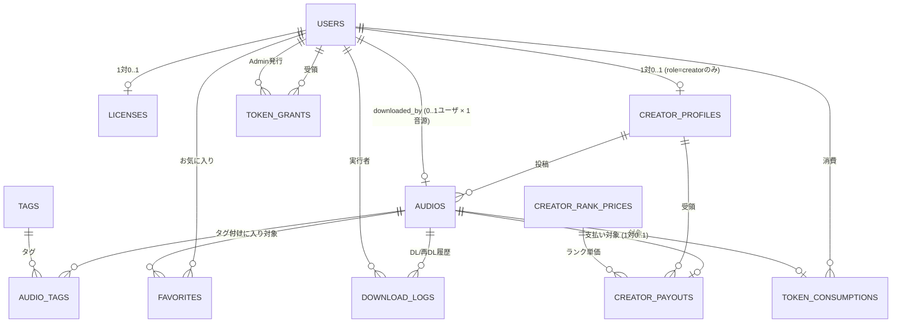

# データモデル — Audio Data Management

PostgreSQL を想定。主キーはすべて UUID v7 (時系列ソート可)。タイムスタンプは `TIMESTAMPTZ`、金額は `INTEGER` (円)、トークン量は `INTEGER` (秒数と同じスケール)。

## 1. ER 概要



## 2. エンティティ定義

### 2.1 `users`

サイト利用者の基本情報。`role` で権限を分岐。

| 列 | 型 | 制約 | 説明 |
|---|---|---|---|
| `id` | UUID | PK | |
| `username` | TEXT | UNIQUE, NOT NULL | 表示名 |
| `email` | TEXT | UNIQUE | 任意 (Phase 2) |
| `role` | ENUM(`user`,`creator`,`admin`) | NOT NULL, DEFAULT `user` | |
| `created_at` | TIMESTAMPTZ | NOT NULL, DEFAULT now() | |
| `updated_at` | TIMESTAMPTZ | NOT NULL, DEFAULT now() | |

### 2.2 `licenses`

`.lic` ファイル発行管理。1ユーザにつき有効なライセンスは原則1件。`monthly_quota_tokens` がユーザの月間DL許容量を決める。

| 列 | 型 | 制約 | 説明 |
|---|---|---|---|
| `id` | UUID | PK | |
| `user_id` | UUID | FK→users.id, UNIQUE | |
| `license_code` | TEXT | UNIQUE, NOT NULL | 公開ID (例: `LIC-2026-0001`) |
| `role` | ENUM | NOT NULL | licファイル内の role |
| `monthly_quota_tokens` | INTEGER | NOT NULL, CHECK (>=0) | 毎月リセットされる月間DL token量 |
| `signature` | TEXT |  | HMAC署名 (Phase 2) |
| `issued_at` | TIMESTAMPTZ | NOT NULL | |
| `expires_at` | TIMESTAMPTZ |  | NULL = 無期限 |
| `revoked_at` | TIMESTAMPTZ |  | 失効日時 |

### 2.3 `creator_profiles`

creator ロール限定の追加情報。

| 列 | 型 | 制約 | 説明 |
|---|---|---|---|
| `user_id` | UUID | PK, FK→users.id | |
| `display_name` | TEXT | NOT NULL | |
| `bio` | TEXT |  | |
| `rank` | ENUM(`bronze`,`silver`,`gold`,`platinum`) | NOT NULL, DEFAULT `bronze` | FR-PAY-02 のキー |
| `payout_method` | JSONB |  | 振込先 (Phase 3) |

### 2.4 `audios`

音源本体。原本は `/storage/sounds/{id}.wav`、視聴用プレビューは `/storage/sounds/{id}_preview.wav` (アップロード時に先頭60秒を切り出し)。
`duration_sec` がそのままDL時のtoken消費量となる (1秒=1token)。
`downloaded_by_user_id` が NULL でない音源は売却済みで、Dashboard 一覧から除外する。

視聴は **プレビューファイルを Range Request でチャンク配信** (非圧縮 PCM 維持、最大 48 kHz / 24 bit)。DL は原本ファイルを signed URL で配信。

| 列 | 型 | 制約 | 説明 |
|---|---|---|---|
| `id` | UUID | PK | |
| `creator_id` | UUID | FK→creator_profiles.user_id, NOT NULL | |
| `title` | TEXT | NOT NULL | |
| `description` | TEXT |  | |
| `file_path` | TEXT | NOT NULL | 原本 `.wav` のパス。例: `/storage/sounds/{id}.wav`。DL 経路でのみ配信 |
| `preview_path` | TEXT | NOT NULL | プレビュー `.wav` のパス。例: `/storage/sounds/{id}_preview.wav`。視聴 Range 配信対象 |
| `preview_duration_sec` | INTEGER | NOT NULL, DEFAULT 60, CHECK (>0 AND <=60) | プレビュー長 (秒)。原本が短ければ duration_sec と同値 |
| `duration_sec` | INTEGER | NOT NULL, CHECK (>0) | 原本長 = token消費量 |
| `sample_rate` | INTEGER | NOT NULL | Hz。例: 44100, 48000。上限 48000 (FR-STREAM-06) |
| `bit_depth` | SMALLINT | NOT NULL | bit。例: 16, 24。上限 24 (FR-STREAM-06) |
| `channels` | SMALLINT | NOT NULL, DEFAULT 2 | 1=mono / 2=stereo |
| `peaks` | JSONB | NOT NULL | 波形プレビュー用 (0..1 配列)。音声デコードに依存しない波形描画用 |
| `is_public` | BOOLEAN | NOT NULL, DEFAULT false | |
| `youtube_safe` | BOOLEAN | NOT NULL, DEFAULT true | YT利用可否 |
| `recommend_score` | NUMERIC(6,2) | NOT NULL, DEFAULT 0 | オススメ順ソート用 |
| `published_at` | TIMESTAMPTZ |  | 公開日時 |
| `downloaded_by_user_id` | UUID | FK→users.id, UNIQUE, NULLABLE | 売却済みなら買い手のID |
| `downloaded_at` | TIMESTAMPTZ |  | 売却日時 |
| `created_at` | TIMESTAMPTZ | NOT NULL, DEFAULT now() | |
| `updated_at` | TIMESTAMPTZ | NOT NULL, DEFAULT now() | |

> インデックス: `idx_audios_published_at`, `idx_audios_recommend_score`, `idx_audios_creator_id`, `idx_audios_available` (`WHERE downloaded_by_user_id IS NULL`)。
>
> 単発販売の排他制御: DLは `UPDATE audios SET downloaded_by_user_id=$1, downloaded_at=now() WHERE id=$2 AND downloaded_by_user_id IS NULL RETURNING *` 形式で必ず実施。0件返却なら売り切れ。

### 2.5 `tags` / `audio_tags`

| 列 (tags) | 型 | 制約 |
|---|---|---|
| `id` | UUID | PK |
| `name` | TEXT | UNIQUE NOT NULL |

| 列 (audio_tags) | 型 | 制約 |
|---|---|---|
| `audio_id` | UUID | FK→audios.id |
| `tag_id` | UUID | FK→tags.id |
| PK | (audio_id, tag_id) | |

### 2.6 `creator_rank_prices`

ランクごとの「1DLあたり支払い単価」テーブル。Admin が編集可能。

| 列 | 型 | 制約 | 説明 |
|---|---|---|---|
| `rank` | ENUM | PK | bronze / silver / gold / platinum |
| `unit_price_yen` | INTEGER | NOT NULL, CHECK (>=0) | 1DLあたりの円 |
| `updated_at` | TIMESTAMPTZ | NOT NULL, DEFAULT now() | |

初期データ:
```
bronze   = 100
silver   = 200
gold     = 400
platinum = 800
```

### 2.7 `creator_payouts`

音源の DL に対する Creator 支払いレコード。FR-PAY-03 により音源1件につき1行。

| 列 | 型 | 制約 | 説明 |
|---|---|---|---|
| `id` | UUID | PK | |
| `audio_id` | UUID | FK→audios.id, UNIQUE, NOT NULL | 1音源 = 1支払い |
| `creator_id` | UUID | FK→creator_profiles.user_id, NOT NULL | |
| `rank_at_payout` | ENUM | NOT NULL | DL時点のランクをスナップショット |
| `unit_price_yen` | INTEGER | NOT NULL | DL時点の単価をスナップショット |
| `amount_yen` | INTEGER | NOT NULL | = unit_price_yen × 1 |
| `status` | ENUM(`pending`,`paid`,`cancelled`) | NOT NULL, DEFAULT `pending` | |
| `paid_at` | TIMESTAMPTZ |  | |
| `paid_by_admin_id` | UUID | FK→users.id |  |
| `created_at` | TIMESTAMPTZ | NOT NULL, DEFAULT now() | DL成立と同時に作成 |

### 2.8 `token_consumptions`

DL時の token 消費履歴。再DLは記録しない (`download_logs` に残す)。
`period_yyyymm` 列により当月消費量の集計が定数時間で可能。

| 列 | 型 | 制約 | 説明 |
|---|---|---|---|
| `id` | UUID | PK | |
| `user_id` | UUID | FK→users.id, NOT NULL | |
| `audio_id` | UUID | FK→audios.id, NOT NULL | |
| `license_id` | UUID | FK→licenses.id, NOT NULL | DL時に有効だったlic |
| `tokens` | INTEGER | NOT NULL, CHECK (>0) | = audio.duration_sec |
| `period_yyyymm` | INTEGER | NOT NULL | DL時刻(JST)の YYYYMM (例: 202605) |
| `created_at` | TIMESTAMPTZ | NOT NULL, DEFAULT now() | |

> インデックス: `idx_tc_user_period (user_id, period_yyyymm)` で残量計算が高速。

### 2.9 `token_grants`

Admin による追加 token 付与。当月分のみ有効 (FR-TKN-06)。

| 列 | 型 | 制約 | 説明 |
|---|---|---|---|
| `id` | UUID | PK | |
| `user_id` | UUID | FK→users.id, NOT NULL | 受領者 |
| `granted_by_admin_id` | UUID | FK→users.id, NOT NULL | 付与した admin |
| `tokens` | INTEGER | NOT NULL, CHECK (>0) | 追加付与量 |
| `period_yyyymm` | INTEGER | NOT NULL | 付与対象月 |
| `reason` | TEXT |  | |
| `created_at` | TIMESTAMPTZ | NOT NULL, DEFAULT now() | |

> 当月残量計算:
> `remaining = (lic.monthly_quota_tokens + SUM(grants当月)) - SUM(consumptions当月)`

### 2.10 `favorites`

| 列 | 型 | 制約 |
|---|---|---|
| `user_id` | UUID | FK→users.id |
| `audio_id` | UUID | FK→audios.id |
| `created_at` | TIMESTAMPTZ | NOT NULL DEFAULT now() |
| PK | (user_id, audio_id) |  |

### 2.11 `download_logs`

監査・利用統計用。初回DL/再DL/失敗試行を全て記録。

| 列 | 型 | 制約 | 説明 |
|---|---|---|---|
| `id` | UUID | PK | |
| `user_id` | UUID | FK→users.id, NULLABLE | |
| `audio_id` | UUID | FK→audios.id, NOT NULL | |
| `kind` | ENUM(`initial`,`redownload`,`denied_no_token`,`denied_sold`) | NOT NULL | |
| `ip` | INET |  | |
| `user_agent` | TEXT |  | |
| `created_at` | TIMESTAMPTZ | NOT NULL DEFAULT now() | |

## 3. 状態遷移

### Audio
```
draft
  └─ published (is_public=true, published_at=now)
       ├─ unpublished (is_public=false, downloaded_by_user_id=NULL)
       └─ sold (downloaded_by_user_id 設定済) ← 終端
              └─ creator_payouts に1行生成 (status=pending)
```

### CreatorPayout
```
pending → paid (Admin手動)
       → cancelled (Admin手動、例: 不正DL扱い)
```

### License
```
issued → revoked
       → expired (expires_at 経過)
```

## 4. 残量計算 (リファレンス SQL)

```sql
WITH g AS (
  SELECT COALESCE(SUM(tokens),0) AS granted
  FROM token_grants
  WHERE user_id = $1 AND period_yyyymm = $2
), c AS (
  SELECT COALESCE(SUM(tokens),0) AS consumed
  FROM token_consumptions
  WHERE user_id = $1 AND period_yyyymm = $2
), q AS (
  SELECT monthly_quota_tokens FROM licenses WHERE user_id = $1
)
SELECT (q.monthly_quota_tokens + g.granted) AS total_granted,
       c.consumed                            AS used,
       (q.monthly_quota_tokens + g.granted - c.consumed) AS remaining
FROM q, g, c;
```

## 5. 命名規約

- テーブル名: 複数形・スネークケース (`audios`, `download_logs`)
- 列名: スネークケース、boolean は `is_*` / `has_*` 接頭辞
- FK列名: `{table_singular}_id`
- timestamp: `*_at`
- 期間集計キー: `period_yyyymm` (INTEGER, JST基準)
