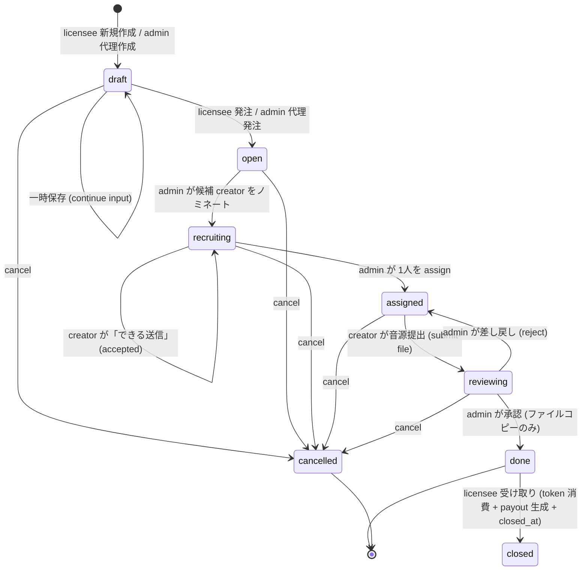
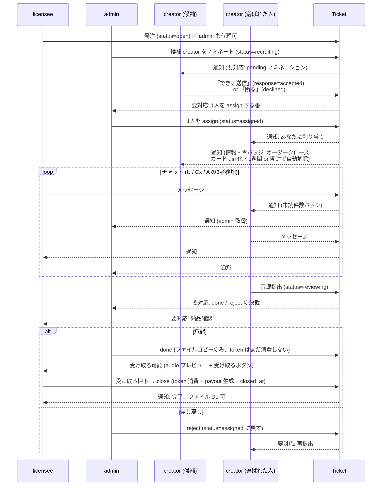

# Commission / Order 機能 要件仕様書

> 最終更新: 2026-05-30 (改訂2.3)  
> 実装状態: 改訂2.3 まで全て実装済 (Phase 3 #39〜#48)  
> 次回着手: [docs/ORDER_SPEC.md §9.1](#91-未実装-実装すべき) 未実装課題 (棚卸し済み)

---

## 1. 概要

**Commission (発注)** は、ユーザーがオリジナル音源の制作をクリエイターに依頼するチケット型ワークフロー機能。

Dashboard の単発 DL 販売とは独立した仕組みであり、ユーザーとクリエイターの3者 (ユーザー / クリエイター / Admin) が1つの発注チケットを通じてコミュニケーションしながら制作を進める。

### 関係者と役割

| ロール | できること |
|---|---|
| licensee | 発注作成・提出・キャンセル / メッセージ / 完了ファイルDL |
| creator | 候補打診への応答 / メッセージ / 音源提出 |
| admin | 上記すべて + 候補指名 / クリエイターアサイン / 承認 / 差し戻し / token_cost調整 / 機能フラグ管理 |

### 機能フラグ

`system_settings` テーブルの `commission_enabled = "true"` で機能ON/OFF。  
OFFの場合、関連API全体が `503 COMMISSION_DISABLED` を返す。  
フロントエンドはマウント時に `GET /api/v1/system/commission` で状態を取得し、OFFなら発注画面を非表示にする。  
**Admin の操作:** `/admin > 設定` タブで ON/OFF を切替可能 (実装済み)。

---

## 2. ステータス遷移

```
draft ──[submit by licensee]──→ open ──[nominate by admin]──→ recruiting
                                 └─────────────────────────────┘
                                         ↓ [assign by admin]
                                      assigned ──[submit-file by creator]──→ reviewing
                                                                                 │
                                                               ┌────[reject]─────┘
                                                               │                 │
                                                            assigned          done ──[DL by licensee]
                                                                         (token消費・payout生成)
 どのステータスからでも [cancel] → cancelled (done/cancelled からは不可)
```

### 各ステータスの意味

| ステータス | 意味 |
|---|---|
| `draft` | 作成済み・未提出。Userが編集可能な状態 |
| `open` | 提出済み。Adminが確認中 |
| `recruiting` | Admin が候補クリエイターに打診中 |
| `assigned` | クリエイター確定。制作中 |
| `reviewing` | クリエイターが音源を提出。Adminが確認中 |
| `done` | Admin承認済み・完了。Userがファイルをダウンロード可能 |
| `cancelled` | キャンセル済み (token消費なし) |

### 遷移条件まとめ

| 遷移 | 誰が | 前提ステータス | 副作用 |
|---|---|---|---|
| `submit` | licensee | draft | **token 残量チェック + 予約開始** (改訂2.2: `available_tokens` が `reserved_by_open_orders` を差し引く実装になり、Order時点で確実に弾く) |
| `nominate` | admin | open / recruiting | `order_candidate_creators` にレコード追加、status → recruiting |
| `respond` | creator | recruiting | candidate の response_status を accepted/declined に更新 |
| `assign` | admin | open / recruiting | creator確定、token_cost 調整可能 |
| `submit-file` | creator | assigned | ファイルをサーバに保存、status → reviewing |
| `reject` | admin | reviewing | status → assigned (差し戻し)、理由メッセージ記録 |
| `done` | admin | reviewing | 提出ファイルを最終パスへコピー / status → done (**token 消費はまだ無い、改訂2.2 で close に移動**) |
| `close` (受け取る) | licensee / admin (代理) | done && closed_at IS NULL | **token 消費 + Creator payout 生成 + closed_at セット** (改訂2.2) |
| `cancel` | licensee / creator / admin | 全て (done, cancelled 以外) | token消費なし |

---

## 3. サウンドブリーフ (ヒアリングフロー)

発注作成時にウィザード形式でユーザーから聞き出した情報を `orders.brief` (JSONB) に格納する。

**設計思想:**  
`images/GameAudioDirectorHearingFlow.md` に基づき、「ジャンル指定より感情指定を優先」「抽象語を具体に分解」「参考曲は要素まで分解」を UI に落とし込む。

### ウィザード構成 (6ステップ)

#### Step 1: 基本情報 (必須)

| フィールド | 型 | 説明 |
|---|---|---|
| `sound_type` | `"bgm" \| "se"` | BGM か SE のいずれか (1曲ずつの発注のため両方併用は不可。改訂2で `"both"` 削除) |
| `purpose` | `"game" \| "video" \| "podcast" \| "other"` | 用途 |
| `purpose_note` | string | purpose=other 時の自由記述 |
| `length_sec` | number | **曲の長さ (秒)**。スライダー 10〜600 + 数値直接入力可。**この値が `token_cost` になる (1秒=1token)** |
| `desired_deadline` | string (ISO date) | 希望締切日。**デフォルト: 作成日 + 7日**。licensee が変更可能 |

**タイトル:** 入力フィールドは廃止 (改訂2)。サーバ側で自動生成:  
形式: `YYYYMMDD_<username>_Order #<serial>`  
例: `20260529_alice_Order #12`  
- `username` は `users.username` をそのまま使用
- serial は **Commission Order 全体の通し番号** (Postgres sequence `orders_serial_seq` で採番)
- **キャンセル/削除された番号は再利用しない** (sequence の単調増加で担保)
- 編集は不可

#### Step 2: シーン/機能設計 (必須)

**BGM の場合:**

| フィールド | 型 | 説明 |
|---|---|---|
| `bgm_scenes` | `string[]` | 使用シーン (複数可)。選択肢: battle / boss / explore / menu / title / event / ending / ambient / other |
| `bgm_loop` | boolean | ループ再生が必要か |
| `bgm_note` | string | シーン補足 (他シーンとの接続、展開など) |

**SE の場合:**

| フィールド | 型 | 説明 |
|---|---|---|
| `se_trigger` | string | 何をしたときに鳴るか (必須) |
| `se_functions` | `string[]` | SEの役割 (複数可)。選択肢: success / danger / ui / operation / immersion / character |

(改訂2で `"both"` 廃止のため、両セクション同時表示は無くなる)

#### Step 3: 感情設計 (必須・核心)

クリエイターが文脈を正確に把握するための最重要ステップ。「かっこいい」等の曖昧語を排し、感情ラベルで具体化する。

| フィールド | 型 | 説明 |
|---|---|---|
| `emotions_target` | `string[]` | 狙う感情 (1つ以上必須)。狙う感情として選んだものは「避ける感情」に選べない |
| `emotions_avoid` | `string[]` | 避けたい感情 (任意) |
| `memory_impression` | string | 聴後に記憶に残したいイメージ (比喩・体験・感覚で自由記述) |

**感情ラベル一覧 (15種):**

```
excitement (高揚感/興奮), tension (緊張感), fear (恐怖/不安),
relief (安らぎ/安心), loneliness (孤独感), grandeur (壮大さ/圧倒感),
speed (疾走感), sadness (哀愁/切なさ), mystery (神秘/異世界感),
achievement (達成感/充足感), heaviness (重厚感/威圧感),
comfort (心地よさ/まったり感), euphoria (爽快感),
dread (じわじわとした恐怖), wonder (驚き/発見の喜び)
```

**UX 補足:** `memory_impression` のプレースホルダー例:  
「勝てる気がしない圧倒的な巨大感」「息を呑む静寂のあと一気に解放される感じ」

#### Step 4: テクスチャ方向 (任意・スキップ可)

5つの二項対立軸で音の質感を方向付ける。各軸は `"a値" | "mid" | "b値" | ""` の3択。

| フィールド | A側 | B側 |
|---|---|---|
| `tx_organic_electronic` | 有機的 / 生楽器 | 電子的 / シンセ |
| `tx_melody_rhythm` | メロディ重視 | リズム重視 |
| `tx_warm_cold` | 温かい / 柔らかい | 冷たい / 無機質 |
| `tx_sparse_dense` | シンプル / 余白 | 重厚 / 音が多い |
| `tx_static_dynamic` | 静的 / 落ち着いた | 激しい / 展開多い |

値: `"organic"` / `"mid"` / `"electronic"` など軸ごとに固定文字列。未選択は `""`。

#### Step 5: 参考音源 (任意・スキップ可)

参考曲そのものでなく「何の要素を参考にするか」まで分解させることで、クリエイターへの指示精度を高める。

| フィールド | 型 | 説明 |
|---|---|---|
| `reference_urls` | string | 参考音源URL (1行1URL、改行区切り) |
| `reference_elements` | `string[]` | 参考にしたい要素 (複数可) |
| `reference_avoid` | string | 逆に避けたい要素・表現 (自由記述) |

**参考要素の選択肢 (8種):**

```
atmosphere (空気感/雰囲気), bass (低音/ベース感), progression (展開/構成),
tempo (テンポ/グルーヴ), timbre (音色/サウンドデザイン),
melody (メロディライン), rhythm (リズムパターン), density (音の密度/空間感)
```

#### Step 6: 技術仕様・確認 (任意 + 確認)

| フィールド | 型 | 説明 |
|---|---|---|
| `delivery_format` | `"wav48k24b" \| "wav44k16b" \| "any" \| ""` | 納品形式 |
| `note` | string | その他補足 (ゲームエンジン、禁止事項など) |

ステップ末尾に入力内容のサマリーを表示し、`token_cost` (= `length_sec`) と `desired_deadline` を確認して発注。

**改訂2 で削除:** `deadline` (Step 1 の `desired_deadline` に統合) / `budget_range` (token_cost = 曲長で確定するため不要)。

#### 一時保存 (draft)

各ステップに「**一時保存**」ボタンを配置。クリック時:
- 入力済みの内容で `status=draft` の order を作成 (既に draft なら更新)
- モーダルを閉じてもデータが残る
- 次回 `/orders` を開いたとき draft 行が表示され、続きから入力可

未保存のままモーダルを閉じる場合は確認ダイアログを出す。

---

## 4. データモデル

### `orders` テーブル

| カラム | 型 | 説明 |
|---|---|---|
| `id` | UUID PK | |
| `user_id` | UUID FK → users | 発注者 |
| `serial` | INT NOT NULL | **Commission Order 全体の通し番号** (改訂2で追加 / 0010で global 化)。Postgres sequence `orders_serial_seq` で採番。キャンセル番号は再利用しない |
| `title` | TEXT NOT NULL | 発注タイトル。**改訂2 で自動生成 (`YYYYMMDD_<username>_Order #<serial>`)** |
| `description` | TEXT | 自由記述 (レガシー。brief 導入後は主に brief を使用) |
| `brief` | JSONB | サウンドブリーフ (§3 参照) |
| `token_cost` | INT > 0 | 消費 token 数 = `brief.length_sec` (改訂2で自動算出)。Admin の手動調整は廃止 |
| `desired_deadline` | DATE | 希望締切日。デフォルト `created_at + 7日` (改訂2で追加) |
| `status` | ENUM | §2 参照 |
| `assigned_creator_id` | UUID FK → creator_profiles | アサインされたクリエイター |
| `assigned_by_admin_id` | UUID FK → users | アサインしたAdmin |
| `assigned_at` | TIMESTAMPTZ | |
| `done_by_admin_id` | UUID FK → users | 承認したAdmin |
| `done_at` | TIMESTAMPTZ | |
| `file_path` | TEXT | 最終納品ファイルのサーバパス |
| `notified_at` | TIMESTAMPTZ | done になった時刻 (通知バッジ用) |
| `created_at` / `updated_at` | TIMESTAMPTZ | |

**改訂2 で追加するインデックス:** `UNIQUE (serial)` (0010 で per-user → global へ変更済み)

### `order_candidate_creators` テーブル

| カラム | 型 | 説明 |
|---|---|---|
| `id` | UUID PK | |
| `order_id` | UUID FK → orders (CASCADE) | |
| `creator_id` | UUID FK → creator_profiles (CASCADE) | |
| `sent_by_admin_id` | UUID FK → users (SET NULL) | 打診したAdmin |
| `sent_at` | TIMESTAMPTZ | |
| `response_status` | ENUM | `pending / accepted / declined` |
| `response_at` | TIMESTAMPTZ | |

### `order_messages` テーブル

| カラム | 型 | 説明 |
|---|---|---|
| `id` | UUID PK | |
| `order_id` | UUID FK → orders (CASCADE) | |
| `sender_id` | UUID FK → users (SET NULL) | NULLはSystem |
| `content` | TEXT | メッセージ本文 |
| `attachment_path` | TEXT | 音源提出時のファイルパス |
| `kind` | ENUM | `comment / status_change / submission / rejection / done / brief_edit` |
| `submission_version` | INT NULL | 改訂2.5: kind=submission のみセット。Order ごとに 1..N |
| `attachment_peaks` | JSONB NULL | 改訂2.5: 提出 wav の peaks v2 (per version) |
| `created_at` | TIMESTAMPTZ | |

> 改訂2.4 で `visibility` カラムは廃止 (migration 0016)。admin↔creator 私信は [DM_SPEC](DM_SPEC.md) に分離した。
> 改訂2.5 (migration 0019): submission を版数管理。ファイル命名は `submissions/{order_id}_v{n}.wav`。

### `order_memos` テーブル (改訂2.4)

Order ごとの共有メモ。admin / creator 各 1 枠で、licensee は完全不可視。詳細は [§16.2](#162-メモ仕様) 参照。

| カラム | 型 | 説明 |
|---|---|---|
| `id` | UUID PK | |
| `order_id` | UUID FK → orders (CASCADE) | |
| `author_kind` | ENUM(`admin`, `creator`) | 枠の種別 |
| `author_id` | UUID FK → users (SET NULL) | 最後の編集者 |
| `content` | TEXT (≤2000 chars) | メモ本文 |
| `created_at` / `updated_at` | TIMESTAMPTZ | |
| UNIQUE (order_id, author_kind) | | 1 Order に admin 1 / creator 1 |

### `system_settings` テーブル

| key | value | 説明 |
|---|---|---|
| `commission_enabled` | `"true" \| "false"` | Commission機能フラグ |

---

## 5. APIエンドポイント

ベースパス: `/api/v1`

### 一般 (認証不要)

| Method | Path | 説明 |
|---|---|---|
| GET | `/system/commission` | `{ "enabled": bool }` を返す |

### licensee ロール以上

| Method | Path | 説明 |
|---|---|---|
| GET | `/orders` | 発注一覧 (role別フィルタ) |
| POST | `/orders` | 発注作成 (status=draft) |
| GET | `/orders/{id}` | 発注詳細 (アクセス制御あり) |
| POST | `/orders/{id}/submit` | draft → open。token残高チェックあり |
| POST | `/orders/{id}/cancel` | キャンセル (done/cancelled 以外から) |
| POST | `/orders/{id}/message` | コメント追加 (done/cancelled 以外) |
| GET | `/orders/{id}/file-url` | 完了ファイルのsigned URL取得 (done時・発注者のみ) |
| GET | `/orders/download-file` | signed URL でファイルDL |
| POST | `/orders/{id}/view` | チケット閲覧記録 (改訂2 追加。`activity_logs` に `order_view` 挿入) |
| PATCH | `/orders/{id}/deadline` | 希望締切日変更 (改訂2 追加。licensee / admin、status≠done/cancelled) |

### creator ロール以上

| Method | Path | 説明 |
|---|---|---|
| POST | `/orders/{id}/respond` | 候補打診への応答 (`accepted / declined`) |
| POST | `/orders/{id}/submit-file` | 音源提出 (multipart, assigned → reviewing) |

### admin ロール

| Method | Path | 説明 |
|---|---|---|
| POST | `/orders/{id}/nominate` | 候補クリエイター指名 (複数可) |
| POST | `/orders/{id}/assign` | クリエイター確定 (token_cost調整可) |
| POST | `/orders/{id}/reject` | 提出差し戻し (reviewing → assigned) |
| POST | `/orders/{id}/done` | 承認・完了 (token消費・payout生成) |
| GET | `/admin/settings` | system_settings 一覧取得 |
| PATCH | `/admin/settings/{key}` | system_settings 更新 |

### アクセス制御ルール

- **licensee**: 自分の発注のみ閲覧・操作可
- **creator**: 候補としてノミネートされたまたはアサインされた発注のみ閲覧・操作可
- **admin**: **全発注の全メッセージ・全候補・全状態を閲覧可** (実装済み)。チケットの宛先に常時含まれる扱い (= 全やりとりを監督できる)

---

## 6. ビジネスルール

### token 消費タイミング (改訂2.2)

| タイミング | 処理 |
|---|---|
| `submit` (draft → open) | token 残高チェックのみ (消費しない) |
| `submit` (draft → open) | **token 予約開始** (`reserved_by_open_orders` に算入)。残量不足ならここで 402 (発注不可) |
| `done` (reviewing → done) | 提出ファイルを最終パスへコピー。**token は消費しない** (改訂2.2 で close に移動) |
| `close` (受け取る) | `token_consumptions` にレコード追加 (`tokens = order.token_cost`、period は受け取り月) + `creator_payouts` 生成 + `closed_at` セット。予約は自動的に外れる |
| `cancel` | 予約を解放 (`closed_at` は変えず status=cancelled、reserved query から外れる) |

**注意:** キャンセルした場合はトークン消費なし。`submit` 時点では残高確認のみで予約ではない (Admin が `assign` 時に `token_cost` を変更する場合があるため)。

### Creator payout 生成

`done` 時に `creator_payouts` にレコードを追加。

- `audio_id = NULL` (音源販売の payout と区別)
- `amount_yen = rank_price.unit_price_yen × order.token_cost`
- `status = pending` (Admin が後から `paid` に変更)

ランク単価 (1トークンあたり):

| ランク | 単価 |
|---|---|
| bronze | ¥100 |
| silver | ¥200 |
| gold | ¥400 |
| platinum | ¥800 |

**例:** gold クリエイター、token_cost=60 → payout = ¥24,000

### ファイル保存

| 種別 | パス |
|---|---|
| 提出ファイル (一時) | `{ORDERS_DIR}/submissions/{order_id}.wav` |
| 最終納品ファイル | `{ORDERS_DIR}/{order_id}.wav` |

`done` 処理時に提出ファイルを最終パスにコピーし、`orders.file_path` に記録。

完了ファイルのDLは **HMAC signed URL** 方式 (TTL 30秒)。JWT不要。

---

## 6.5 通知ルール (改訂2)

> **通知の横断仕様は [NOTIFICATION_SPEC.md](NOTIFICATION_SPEC.md) を参照。**
> ここでは Commission 固有の通知源マッピングのみ記述する。

### A. 要対応通知 (action-required)

返信・決裁・作業など、**何らかの操作が必要**な通知。完了するまでバッジに残る。

| イベント | 受信側 | 解除条件 |
|---|---|---|
| 発注 submit (open) | admin | 候補ノミネート完了 |
| ノミネート送信 | 候補 creator 各人 | accept/decline 応答 |
| 「できる送信」 (accept) | admin | 1人を assign |
| assign 確定 | 選ばれた creator | 音源提出 |
| 提出 (reviewing) | admin | done / reject |
| チケット内メッセージ送信 | 自分以外の宛先 (licensee / creator / admin) | チケットを開く (= `activity_logs` に `order_view` 追加) |
| done | 発注 licensee | チケットを開く (= 受け取り) |

### B. 情報通知 (info-only)

返信不要・読むだけで完了する純情報。**自動解除あり**。

| イベント | 受信側 | 解除条件 |
|---|---|---|
| オーダーがクローズされた (他 creator にアサイン済) | 候補だった creator | **Commission を開く** OR **1週間経過** で自動解除 |

**通知コピー:** 「『${title}』のオーダーがクローズされました。」
　("選ばれなかった" を主語にしない。時間的フレームで表現)

### C. dim (クローズ済みカードの視覚表現)

assign 確定 / cancelled / close 後の対象チケットは **dim 化** する (詳細は [NOTIFICATION_SPEC §8](NOTIFICATION_SPEC.md))。

- 該当 status: 候補 creator にとって `assigned`(他者) / `cancelled`、licensee にとって `cancelled` / `close` 後
- ステータスラベルは「**クローズ**」に変更 (muted カラー)
- バッジ (青ドット) が解除されてもカードの dim は **維持**

### 内部実装

- `activity_logs` (`kind=order_view`, `target_id=order_id`) を「既読」マーカーとして使う
- 各通知ロジックは:
  「最後に `order_view` した時刻 < 通知発生時刻 (status_change / message.created_at)」を未読と判定
- 情報通知の 1週間自動解除は: `order.updated_at < now - 7days` で除外
- 視覚仕様 (色・dim ルール) は [NOTIFICATION_SPEC §7-8](NOTIFICATION_SPEC.md) に従う

---

## 7. フロントエンド構成

| ページ | パス | ロール |
|---|---|---|
| 発注一覧・作成 | `/orders` | licensee / creator / admin |
| 発注詳細・メッセージ | `/orders/[id]` | アクセス制御あり |
| Admin: 全発注管理 | `/admin` > Commissionタブ | admin |

### 発注作成ウィザード

`OrderBriefWizard.vue` コンポーネント (モーダル内)。  
6ステップウィザード。Step 1-3 は必須、Step 4-5 はスキップ可。  
Step 2 は `sound_type` (BGM/SE/both) によって表示項目が変わる。

### 発注詳細ページ (`/orders/[id].vue`)

- **ブリーフ表示**: カテゴリ別 (基本 / BGMシーン / SE設計 / 感情設計 / テクスチャ / 参考 / 技術仕様) に構造表示
  - 狙う感情: アクセントカラーチップ
  - 避ける感情: 打ち消し線チップ
  - 記憶イメージ: イタリック引用スタイル
- **メッセージスレッド**: kind 別スタイリング (status_change / submission / rejection / done)
- **操作ボタン**: role × status の組み合わせで表示/非表示

---

## 8. エラーコード一覧

| コード | HTTP | 意味 |
|---|---|---|
| `COMMISSION_DISABLED` | 503 | 機能フラグ OFF |
| `INVALID_TOKEN_COST` | 422 | token_cost ≤ 0 |
| `INSUFFICIENT_TOKENS` | 402 | token残高不足 |
| `INVALID_STATE` | 409 | 現在ステータスから遷移不可 |
| `NOT_CANDIDATE` | 403 | 候補でないクリエイターが respond を試みた |
| `FORBIDDEN` | 403 | アクセス権限なし |
| `NOT_FOUND` | 404 | 発注が存在しない |
| `NO_SUBMISSION_FILE` | 409 | done 処理時に提出ファイルが存在しない |
| `NO_LICENSE` | 403 / 422 | ライセンスなし |
| `CREATOR_NOT_FOUND` | 404 | assign 対象のクリエイターが存在しない |
| `INVALID_RESPONSE` | 422 | respond の response 値が不正 |
| `FILE_NOT_FOUND` | 404 | DL 対象ファイルがサーバ上に存在しない |

---

## 9. 未確定・今後の課題 (2026-05-31 更新)

「次に手をつけるべきもの」が一目で見える棚卸し。実装済は §9.2 に移動済。

### 9.1 未実装 (実装すべき)

| # | 項目 | 優先度 | 備考 |
|---|---|---|---|
| 9-A8 | **本番ストレージ移行** | Phase 4 | ローカル `/storage/*` → S3 互換切替 |

### 9.2 実装済

| # | 項目 | 完了コミット |
|---|---|---|
| ✅ | 通知バッジ (action-required count) | Phase 3 #41 (d2fe503) |
| ✅ | 改訂2 全面実装 (タイトル自動生成 / 曲長→token / draft保存 / 通知二系統 / global serial) | Phase 3 #43 (c5a65b6) |
| ✅ | Admin ログ機能 (集計4 API + SVG チャート 5種) | Phase 3 #44 (0e2417f) |
| ✅ | 改訂2.1 発注後ブリーフ編集 (diff色 + bot通知 + 履歴) | Phase 3 #47 (ca99847) |
| ✅ | 改訂2.2 REDMINE + 受け取る + アーカイブ + 音源プレビュー + チャット添付 | Phase 3 #48 (7ca5a28) |
| ✅ | token 消費を done → close (受け取る) に移動 + 予約ロジック | 0d9a730 / c73ab9b |
| ✅ | Admin Commission UI 改修 (creator ブラウザ + 候補一覧) | 42d7d30 |
| ✅ | TopNav 再構成 + Open ボタン + /orders ルート衝突解消 | 94bc2e2 / d666394 / ab8679e |
| ✅ | 改訂2.3 LINE 風チャット (admin↔creator 私信は 2.4 で廃止) | d9c2180 |
| ✅ | **9-A1** メッセージ未読カウント精緻化 (visibility フィルタ) | 1352576 |
| ✅ | **9-A2** クローズ済み発注の dim 化 (`closed_for_me` + ラベル muted) | 1352576 |
| ✅ | **9-A11** submission ファイル peaks v2 (migration 0015 + 自動生成) | 55ae650 |
| ✅ | **NOTIFICATION_SPEC** 横断仕様策定 (UX原則 / 階層伝播 / 領域非依存 API / dim) | 995018f |
| ✅ | **NOTIFICATION Phase B** 統合 API `/me/notifications` + admin タブ Level 3 ドット | 3d2f4c1 |
| ✅ | **NOTIFICATION Phase C** 一覧 Level 4 per-row 金ドット (orders + payouts) | 2d327f1 |
| ✅ | **改訂2.4** 私信廃止 + admin Commission メニュー統合 (R2.4-B) | e3cba8c |
| ✅ | **改訂2.4** Order 共有メモ (admin/creator 各1枠、左右分割、licensee 不可視) (R2.4-A) | 75aac99 |
| ✅ | **改訂2.4** admin↔creator Direct Message (DM_SPEC Phase A-D) | 3889d85 |
| ✅ | **9-A3** Creator 複数提出のバージョン管理 (`submissions/{id}_v{n}.wav` + peaks v2 per version + GET /submissions + 履歴 UI) + リテラルルート順序バグ修正 | (改訂2.5 / migration 0019) |
| ✅ | **9-A4** クリエイター視点 UI 最適化 (役割優先順序の brief 再構成 + tx_* スライダー視覚化 + 視点切替トグル + localStorage 保存) | (改訂2.5) |
| ✅ | **9-A7** R2-Q1〜Q3 (sound_type=both UI 対応済み / 期限超過アラート色 / draft 30日自動削除) | — |
| ✅ | **9-A6** R2.1-Q1〜Q3 (reviewing 中編集不可維持 / 編集回数上限なし / 自動 assign 取消なし: 設計決定のみ) | — |
| ✅ | **9-A5** SE 複数バリエーション納品 (`se_slots` フィールド / `_vN_sM.wav` 命名 / multi-file submit / スロットタブ preview / migration 0020) | — |
| ✅ | **9-A12** NOTIFICATION Phase E (POST /view から prev_view_at を返す / チャット「ここから未読」ディバイダー / 未読位置へ自動スクロール) | — |
| ✅ | **9-A13** メモ既読マーカー (MemosResponse に admin/creator_last_view_at を追加 / メモ枠に「確認済 / 未確認」表示) | — |

---

## 10. 用語

| 用語 | 説明 |
|---|---|
| 発注 / Order | ユーザーが制作依頼を出すチケット1件 |
| サウンドブリーフ / Brief | 発注時にウィザードで入力した構造化ヒアリングデータ (JSONB) |
| 候補 / Candidate | Admin が打診したクリエイター。応答前は pending |
| 提出 / Submission | クリエイターが音源ファイルをアップロードするアクション |
| 差し戻し / Reject | Admin が提出を却下し、assigned に戻す操作 |
| Commission | 本機能全体の名称。単発DL販売 (Dashboard) とは独立 |

---

## 11. 改訂2 サマリ (2026-05-29)

ユーザ要望に基づく仕様変更点。**未実装** — 次回セッションでフロント/バックエンドに反映する。

### 11.1 入力仕様の変更

| # | 変更 | 影響範囲 |
|---|---|---|
| R2-01 | **発注タイトル入力廃止** → サーバ側で `YYYYMMDD_<username>_Order #<serial>` 自動生成。**serial は Commission Order 全体の通し番号 (sequence 採番、cancel 番号は再利用しない)** | orders スキーマ (`serial` 列 + sequence) / CreateOrderRequest / Wizard step6 / 一覧表示 |
| R2-02 | `sound_type` から **`both` 削除** (`bgm` / `se` の二択) | OrderBriefWizard step1/step2 / OrderBrief 型 / 詳細画面の表示分岐 |
| R2-03 | **希望締切 (`desired_deadline`)** Step1 に追加 / デフォルト `created_at + 7日` / licensee 編集可 | orders スキーマ / Wizard step1 / 詳細画面に編集 UI |
| R2-04 | **`token_cost` 自動算出** = `length_sec`。手入力廃止 / Step1 で曲長スライダー (10〜600s) + 直接入力 | Wizard step1 / step6 / API (token_cost を body で受けない) |
| R2-05 | Step6 から `deadline` `budget_range` 削除 | Wizard step6 / OrderBrief 型 |

### 11.2 ドラフト保存 UI

| # | 変更 |
|---|---|
| R2-06 | 各 step に「**一時保存**」ボタン追加。`status=draft` で保存。再開可能 |
| R2-07 | モーダル close 時に未保存なら確認ダイアログ |
| R2-08 | 既存 draft があれば `/orders` 一覧で先頭に「[編集] 続きから入力」リンク表示 |

### 11.3 通知ルール再設計 (§6.5 参照)

| # | 変更 |
|---|---|
| R2-09 | 通知を **要対応 (action-required)** / **情報 (info-only)** に二分類 |
| R2-10 | メッセージ未読: `activity_logs.order_view` の最終時刻と比較して件数バッジ表示 |
| R2-11 | オーダークローズ通知 (情報・青バッジ) は **開く** OR **1週間** で自動解除。カードは dim (opacity 40〜50% + ラベル「クローズ」muted) を維持。コピーはタイトル＋「クローズされました」のみ (拒絶表現なし) |
| R2-12 | `POST /orders/{id}/view` を追加し、詳細ページ open 時に activity_logs へ記録 |

### 11.4 admin 権限の明文化

| # | 変更 |
|---|---|
| R2-13 | admin は全 licensee/creator のチケット全閲覧可。チケットの宛先に常時含まれる扱い (実装は現状通り) |

### 11.5 必要マイグレーション

```sql
-- 改訂2 用 alembic migrations
-- 0008: per-user 連番 + desired_deadline 追加 (初期実装)
ALTER TABLE orders ADD COLUMN user_serial INT;
ALTER TABLE orders ADD COLUMN desired_deadline DATE;
CREATE UNIQUE INDEX uq_orders_user_serial ON orders (user_id, user_serial);

-- 0010: global 通し番号化 (改修)
ALTER TABLE orders DROP CONSTRAINT uq_orders_user_serial;
ALTER TABLE orders RENAME COLUMN user_serial TO serial;
CREATE SEQUENCE orders_serial_seq AS BIGINT START WITH 1;
-- 全 orders を created_at 昇順で再付番後、sequence を MAX に揃える
ALTER TABLE orders ALTER COLUMN serial SET DEFAULT nextval('orders_serial_seq');
CREATE UNIQUE INDEX uq_orders_serial ON orders (serial);
-- cancel/削除しても番号は再利用されない (sequence の単調増加)
```

### 11.6 残課題 → 解決済み (9-A7)

| # | 内容 | 決定事項 |
|---|---|---|
| R2-Q1 | `sound_type=both` で既に作成済みの order の扱い | **UI 表示のみ対応**。詳細/一覧で `both` → "BGM + SE" 表示済み。data migration 不要 |
| R2-Q2 | `desired_deadline` を過ぎた order の扱い | **アラート色**。active status かつ過去日なら締切テキストを `text-accent` (赤) 表示。自動キャンセルなし |
| R2-Q3 | draft 放置時の自動削除ポリシー | **30 日未操作で自動削除**。FastAPI lifespan 起動時に実行。admin は `POST /api/v1/orders/cleanup-drafts?days=30` で手動実行可 |

---

## 12. フローチャート (状態遷移 + 役割)

### 12.1 状態遷移 (全体)



### 12.2 3者参加チケットの操作フロー



### 12.3 admin の権限早見表

| 操作 | licensee (owner) | admin |
|---|---|---|
| draft の表示 (`GET /orders/{id}`) | 自分のみ | 全 licensee の draft |
| draft の編集 (`PATCH /orders/{id}/draft`) | 自分のみ | **全 licensee の draft (代理編集 / 改訂2.1 で開放)** |
| draft の発注 (`POST /orders/{id}/submit`) | 自分のみ | **代理発注可 / 改訂2.1 で開放** (token 残量は order.licensee の license で判定) |
| 候補ノミネート (`POST /orders/{id}/nominate`) | × | ○ |
| assign 確定 (`POST /orders/{id}/assign`) | × | ○ |
| reject (`POST /orders/{id}/reject`) | × | ○ |
| done (`POST /orders/{id}/done`) | × | ○ |
| 締切編集 (`PATCH /orders/{id}/deadline`) | 自分のみ | ○ |
| キャンセル | 自分のみ | ○ |
| メッセージ送信 | チケット宛先のみ | 常時可 (3者宛先) |

---

## 13. 発注後ブリーフ編集 (改訂2.1: 実装済)

ユーザが draft を提出 (status=open) した後、creator とのやりとりを通じて要件が固まる過程でブリーフの**事後編集**が必要になることがある。

### 13.1 ユーザ要求

- licensee が発注後でもチケット内でブリーフを編集できる
- 編集された箇所は**色変化**で視覚的に区別
- チャットに**bot 通知** (例:「ブリーフを編集しました: 狙う感情, 長さ」) が自動投稿される
- creator/admin は変更を即時把握でき、認識ズレを防止

### 13.2 データモデル変更案

**新規テーブル `order_brief_edits`** (変更履歴):

| カラム | 型 | 説明 |
|---|---|---|
| `id` | UUID PK | |
| `order_id` | UUID FK → orders | |
| `editor_id` | UUID FK → users | 編集者 (licensee / admin) |
| `field_path` | TEXT | 変更フィールド (例: `"emotions_target"`, `"length_sec"`) |
| `old_value` | JSONB | 変更前の値 |
| `new_value` | JSONB | 変更後の値 |
| `created_at` | TIMESTAMPTZ | |

### 13.3 編集可能なステータス

| status | brief 編集可? | 補足 |
|---|---|---|
| draft | ○ | `PATCH /orders/{id}/draft` (既存) |
| open | ○ | nominate 前なら自由 |
| recruiting | △ | 候補が「できる」と返答済の場合は警告表示推奨 |
| assigned | △ | creator にメッセージで通知必須 |
| reviewing | × | 提出済音源との不整合を防ぐため不可 |
| done / cancelled | × | 不可 |

### 13.4 新規 API

```
PATCH /api/v1/orders/{id}/brief-after-submit
Authorization: Bearer <token>

Body:
{
  "brief": { ... 更新された brief 全体 },
  "edited_fields": ["emotions_target", "length_sec"]  // 変更箇所を明示
}
```

**振る舞い:**
1. `order_brief_edits` に各フィールドの old/new を記録
2. `orders.brief` を新内容で上書き
3. `OrderMessage` に bot メッセージを 1件追加:
   - `sender_id = NULL` (system)
   - `kind = OrderMessageKind.brief_edit` (新規 enum 値)
   - `content = "ブリーフを編集しました: {field 名の日本語リスト}"`
4. `length_sec` が変わった場合は `token_cost` も再計算

### 13.5 フロントエンド表示

**詳細画面 (`/orders/[id]`):**
- ブリーフ表示エリアを編集可能フォームに切替 (ユーザ/admin の所有者のみ)
- **編集された field は背景色を `accent/10` に**、`title="編集済 (yyyy-MM-dd HH:mm)"` でホバー時に最新編集日時表示
- **編集履歴アイコン** (時計アイコン) → クリックで `order_brief_edits` の差分一覧をモーダル表示

**チャットスレッド:**
- `kind = brief_edit` のメッセージは特別スタイル (ファイル絵文字 + accent 色 + system 表記)
- 差分のうち変更前 → 変更後を 2 行で表示:
  ```
  ✏️ ブリーフを編集しました
  狙う感情: tension, fear → tension, dread
  長さ: 60秒 → 90秒
  ```

### 13.6 実装タスク (全完了)

| # | 内容 | 状態 |
|---|---|---|
| R2.1-01 | migration 0012: `order_brief_edits` + `OrderMessageKind.brief_edit` enum 追加 | ✅ |
| R2.1-02 | API: `PATCH /orders/{id}/brief-after-submit` + `GET /orders/{id}/brief-edits` | ✅ |
| R2.1-03 | 詳細画面に「ブリーフを編集」ボタン + wizard プリフィル起動 | ✅ |
| R2.1-04 | 編集済 field の `bg-accent/10` ハイライト + 履歴モーダル (時計アイコン) | ✅ |
| R2.1-05 | チャット内 `brief_edit` メッセージ専用スタイル (`System (Brief Bot)` + accent 左ボーダー) | ✅ |
| R2.1-06 | `length_sec` 変更で `token_cost` 再計算 + 残量再チェック (差分 token 不足で 402) | ✅ |

### 13.7 未確定事項 → 解決済み (9-A6)

| # | 内容 | 決定事項 |
|---|---|---|
| R2.1-Q1 | reviewing 状態で creator が音源提出後の編集を許可するか | **不可を維持**。提出後のブリーフ変更は creator に不公平。admin による差し戻し (`reject`) で対応 |
| R2.1-Q2 | 編集回数の上限 | **上限なし**。admin が brief_edit 通知を受け取り仲介できるため不要。問題が発生したら追加 |
| R2.1-Q3 | `length_sec` 大幅変更時の自動 assign 取消 | **実装しない**。admin が bot 通知 (`brief_edit`) で変更を把握し、必要なら手動で差し戻し/再 assign |

---

## 14. 改訂2.2 サマリ (2026-05-30)

REDMINE 風 ID / 件名分離 + 受け取る/アーカイブ + 音源プレビュー + チャット添付。

| # | 変更 | 実装場所 |
|---|---|---|
| R2.2-01 | `_generate_title` から `#N` 削除 (件名と ID を完全分離) | orders.py |
| R2.2-02 | `POST /orders/{id}/close` (licensee の「受け取る」) | orders.py |
| R2.2-03 | `orders.closed_at` カラム + フィルタ (admin の archive タブで管理) | migration 0013 |
| R2.2-04 | submission stream エンドポイント (チケット参加者プレビュー) | orders.py + signed_url.py |
| R2.2-05 | チャット欄に音源添付ボタン (creator が提出 UI を統合) | orders/[id].vue |
| R2.2-06 | 受け取る押下時に token 消費 + payout 生成 (done 時の消費を廃止) | orders.py |
| R2.2-07 | submit 時の token 予約 (`reserved_by_open_orders`) → Order時点で残高不足を確実に弾く | services/tokens.py |
| R2.2-08 | admin の発注リスト行を明示ボタン化 (Open ラベル) | admin.vue |
| R2.2-09 | admin の nominate/assign を creator 一覧ブラウザ化 (ランクフィルタ + 検索 + 候補ラジオ) | orders/[id].vue |
| R2.2-10 | admin タブ「Commission」を /orders へのリンク化 (Q.B 統合方針) | admin.vue |

---

## 15. 改訂2.3 サマリ (2026-05-30)

LINE 風チャット + admin↔creator 私信 + 細部 UX。

| # | 変更 | 実装場所 |
|---|---|---|
| R2.3-01 | `order_messages.visibility ENUM('public', 'admin_creator')` | migration 0014 |
| R2.3-02 | `AddMessageRequest.private` フィールド追加 (admin/creator のみ有効) | orders.py |
| R2.3-03 | `_visible_messages()` で viewer role に応じてフィルタ (licensee は admin_creator 不可視) | orders.py |
| R2.3-04 | LINE 風チャット吹き出し UI (自分=右、相手=左、アバター頭文字 + 役割色) | orders/[id].vue |
| R2.3-05 | 連続発言は名前・アバター省略 (5分超で再表示) + 自動スクロール最下部 | orders/[id].vue |
| R2.3-06 | 私信送信 UI (admin / creator のみ表示)、有効時は紫色で強調 | orders/[id].vue |
| R2.3-07 | TopNav: deactivate → `/dashboard` 強制遷移 (Guest 化) | TopNav.vue |
| R2.3-08 | TopNav: admin にも Commission メニュー復活 (通知バッジ受信導線) | TopNav.vue |
| R2.3-09 | Admin タブ font 12→14、'発注管理' → 'Commission'、'詳細を開く →' → 'Open' | admin.vue |

### 15.1 残課題 (改訂2.3 由来)

| # | 内容 | 優先度 |
|---|---|---|
| R2.3-Q4 | チケット LINE UI での 「タイピング中…」 表示 / リアルタイム更新 (WebSocket) | Phase 4 |

> R2.3-Q1〜Q3 は **改訂2.4 で私信機能ごと廃止** されたため終了 (§16 参照)。

---

## 16. 改訂2.4 サマリ (2026-05-31)

Order 内 admin↔creator 私信を **廃止** し、用途別に2機能へ分離する:

| 機能 | 場所 | 用途 |
|---|---|---|
| **共有メモ** (Memo) | Order 内 (brief 下部) | この Order についての admin / creator のメモ書き |
| **DM (Direct Message)** | Order と独立 | admin ↔ creator の継続的やりとり (詳細は [DM_SPEC.md](DM_SPEC.md)) |

### 16.1 変更概要

| # | 変更 | 実装場所 |
|---|---|---|
| R2.4-01 | `order_messages.visibility` カラム削除 (data 削除) | migration 0016 |
| R2.4-02 | `_visible_messages()` の visibility フィルタ削除、`AddMessageRequest.private` 廃止 | orders.py |
| R2.4-03 | チャット LINE UI から「私信送信」UI を撤去 | orders/[id].vue |
| R2.4-04 | 新規 `order_memos` テーブル (admin 枠 / creator 枠 各1) | migration 0017 |
| R2.4-05 | brief 下部に左右分割メモ UI (左=admin / 右=creator) | orders/[id].vue |
| R2.4-06 | `[メモ]` ボタンで自身の枠のみ編集可。licensee 不可視 | orders/[id].vue |
| R2.4-07 | TopNav: admin の Commission メニュー項目を撤去 (Admin → Commission タブに統合) | TopNav.vue |
| R2.4-08 | DM 機能は [DM_SPEC.md](DM_SPEC.md) を一次ソースとする | (別 spec) |

### 16.2 メモ仕様

#### データモデル

| カラム | 型 | 説明 |
|---|---|---|
| id | UUID PK | |
| order_id | UUID FK | Order への参照 |
| author_kind | ENUM('admin','creator') | 枠の種別 (Order ごとに各1) |
| author_id | UUID FK users.id | 最後に編集した admin / creator (記録用) |
| content | TEXT (≤2000 chars) | メモ本文 |
| created_at / updated_at | TIMESTAMPTZ | |
| UNIQUE (order_id, author_kind) | | 1 Order に admin 1 / creator 1 |

#### アクセス制御

| ロール | 閲覧 | 編集 |
|---|---|---|
| licensee | × (完全不可視) | × |
| creator (assigned) | ○ (両枠) | ○ (creator 枠のみ) |
| creator (候補のみ・未assigned) | × | × |
| admin | ○ (両枠) | ○ (admin 枠のみ) |

- 候補段階の creator はメモ不可視 (assigned 確定後に出現)
- メモは `status in (cancelled, close後)` で **編集不可 (履歴凍結)**。閲覧は可
- 文字数上限: **2000 文字**
- 通知: メモ更新は **通知しない** (確認時に見るだけのもの。NOTIFICATION_SPEC の原則「やること=通知」に従う)

#### API

| Method | Path | 説明 |
|---|---|---|
| GET | `/orders/{id}/memos` | 両枠のメモを返す (licensee は 403) |
| PUT | `/orders/{id}/memo` | 自分の枠のメモを upsert (body: `{content: str}`) |

#### UI 配置

```
[ブリーフ詳細]
  狙う感情 / 長さ / シーン / 参考 ...

  ┌────────────────────────┬────────────────────────┐
  │ 📝 Admin メモ      [メモ] │ 📝 Creator メモ    [メモ] │
  │ このクライアントは癖あり…   │ サビは爽快感を意識します。  │
  └────────────────────────┴────────────────────────┘

[チャット]
  ...
```

### 16.3 既存データの扱い

- `order_messages.visibility = 'admin_creator'` のレコードは **migration 0016 で物理削除**
- 既存の `public` メッセージ表示は変わらない
- `visibility` カラム自体も同 migration で drop
